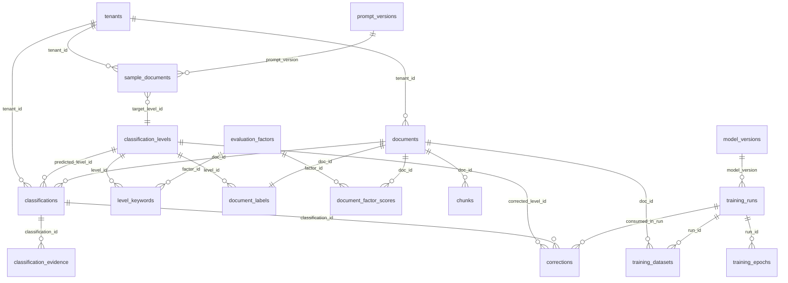

# KIPRA AI 영업비밀관리시스템 — 전체 워크플로우
## 인터뷰용 한 장 요약 + 상세 + Q&A 대비

작성일: 2026-05-26
**읽는 법**: 위에서 아래로 — 점점 자세해집니다. 인터뷰 처음엔 §1만 보여주고, 깊은 질문 들어오면 §2~§4로 내려가세요.

---

## §1. 30초 요약 — 이것 하나만 보여주세요

### 무엇을 만드는가
**문서를 업로드하면 AI가 4단계 보안등급(특급/1급/2급/3급)을 자동 분류하는 시스템.**
한국지식재산보호원이 영업비밀 관리를 위해 발주, 각 기업이 온프레미스 Docker로 설치해 사용.

### 누가 무엇을 만드는가
```
┌──────────────────────────┐         ┌──────────────────────────┐
│  KL (협력사) — 18개 기능 │ ◀────▶ │  로이드케이 — 6개 기능   │
│                          │  REST   │                          │
│  웹 UI · 로그인 · 보관함 │  API    │  AI 등급 분류 엔진       │
│  권한 · 워터마크 · 감사  │         │  (학습 + 추론 + 평가)    │
└──────────────────────────┘         └──────────────────────────┘
```

### 로이드케이 6개 기능 (FUN-ID)
```
FUN-022 ─► FUN-023 ─► FUN-004 ─► FUN-005 ─► FUN-024
[전처리] [라벨링] [학습]  [추론]  [평가/능동학습]
                    ▲
                    │
                FUN-003 [LLM 합성 데이터]
```

### 핵심 한 줄
> **"한국어 문서를 받아서 → 분해·정규화 → BERT 모델로 등급 추론 → RAG로 보강 → 미탐 최소화하며 운영"**

---

## §2. 5분 설명 — 데이터 흐름 전체

### 2-1. 큰 그림 (사용자 한 명이 문서를 올렸을 때)

```
[1] 사용자가 HWP 문서 업로드 (KL 웹 UI)
       │
       ▼
[2] KL 백엔드가 Lloydk API 호출: POST /classify
       │  (Body: {doc_id, content, use_rag, tenant_id})
       ▼
┌─────────────────────────── Lloydk AI Engine ───────────────────────────┐
│                                                                        │
│  [3] M2 전처리 (FUN-022)                                              │
│      HWP → rhwp-python으로 텍스트 추출                                │
│      → 불용어/공백/특수문자 정규화                                    │
│      → 머리글·푸터 제거                                               │
│      → 512토큰 청크로 분할                                            │
│                                                                        │
│  [4] M3 라벨링 보조 (FUN-023)                                         │
│      YAML 규칙으로 4대 평가요소 점수 계산                             │
│      (경제적가치/비공지성/관리수준/유출영향도)                        │
│      → evidence span 추출 (어디 키워드 때문에 점수가 올랐나)          │
│                                                                        │
│  [5] (옵션) RAG 검색                                                  │
│      KURE-v1 임베딩 → Elasticsearch 하이브리드(kNN+BM25+RRF) Top-K   │
│      → 기업 사내규정·KIPRA 가이드 청크 가져옴                         │
│                                                                        │
│  [6] M5 추론 (FUN-005)                                                │
│      KF-DeBERTa 분류기로 각 청크별 등급 확률 출력                    │
│      → 청크 어그리게이션(평균/투표) → 문서 단위 라벨                  │
│      → RAG ON이면 컨텍스트 등급 분포로 보강                          │
│                                                                        │
│  [7] 응답 구성                                                        │
│      {label: "S1", confidence: 0.87,                                  │
│       scores: {TS:0.05, S1:0.87, S2:0.06, S3:0.02},                  │
│       evaluation_factors: {...4개...},                                │
│       evidence: [...키워드 span 10개...],                             │
│       model_version: "v-a3b2c1"}                                      │
│      → status: "staging" (관리자 확정 대기)                           │
│      → Postgres inference_result 테이블에 저장                        │
└────────────────────────────────────────────────────────────────────────┘
       │
       ▼
[8] KL이 응답 받아서 → 관리자 UI에 표시
       │
       ▼
[9] 관리자가 확인 후 두 가지 길:
    (a) 맞다 → /confirm → 최종 라벨 확정
    (b) 틀렸다 → /relabel → 능동학습 큐로 (FUN-024)
                                  │
                                  ▼
                       (큐 100건 누적되면 자동 재학습 트리거)
```

### 2-2. 학습은 언제 어떻게 일어나나

```
[학습 트리거] (관리자 수동 or 능동학습 임계 도달)
       │
       ▼
[M1 합성 데이터 생성] (FUN-003)
   • 실제 영업비밀은 외부 공개 불가 → LLM으로 가상 문서 생성
   • Claude Sonnet 4.6 또는 Qwen3-14B로 등급별 800~1,500건
   • LangChain 프롬프트 체인 + JSON 출력 파서
   • 자동 PII 필터 + 관리자 검수
       │
       ▼
[DatasetBuilder]
   • 합성문서 + 공개데이터(AI Hub/공공데이터) + 재라벨 누적분
   • Train 70% / Val 15% / Test 15% 자동 분할 (Stratified)
   • 청크 분할 (512토큰)
       │
       ▼
[M4 학습] (FUN-004)
   • 베이스 모델: KF-DeBERTa-base (카카오뱅크, 한국어 금융/법률 도메인)
   • 4-class 분류 헤드 + Class Weight (불균형 보정)
   • GPU 학습 (발주처 제공)
   • Early Stop 기준: val_FNR_overall (미탐율 최소화)
   • 모든 실험은 MLflow에 자동 로깅
       │
       ▼
[M6 평가] (FUN-024)
   • Test셋으로 Accuracy / Precision / Recall / F1 / FNR 계산
   • Confusion Matrix (등급별 오분류 어디로 새나)
   • 미탐(고등급→저등급 오분류)에 비대칭 가중치
       │
       ▼
[모델 레지스트리]
   • 가중치를 MinIO에 업로드
   • Postgres에 model_version 기록
   • Staging 등록 → 관리자 승인 시 Production 승격
```

---

## §3. 전체 인프라 한 장 (Docker 컨테이너 단위)

```
┌──────────────────────────────────────────────────────────────────────┐
│                         기업 사내 서버 (Docker Compose)              │
│                                                                      │
│  ┌────────────┐    ┌─────────────────┐    ┌────────────────────┐    │
│  │ KL 웹시스템│◀──▶│ Lloydk API      │◀──▶│ Celery Worker      │    │
│  │ (별도 팀)  │REST│ (FastAPI)       │    │ (학습/합성/일괄)   │    │
│  └────────────┘    │ Port 8000       │    └─────────┬──────────┘    │
│                    └────────┬────────┘              │               │
│                             │                       │               │
│         ┌───────────────────┴───────────────────────┴───────────┐   │
│         │                                                       │   │
│         ▼            ▼              ▼            ▼              ▼   │
│  ┌──────────┐ ┌──────────┐  ┌──────────┐ ┌──────────┐ ┌──────────┐ │
│  │PostgreSQL│ │   ES     │  │ MinIO    │ │ Redis    │ │ MLflow   │ │
│  │ (메타DB) │ │ (벡터DB) │  │ (S3호환) │ │ (큐/캐시)│ │ (실험UI) │ │
│  │ Port 5432│ │ Port 6333│  │ Port 9000│ │ Port 6379│ │ Port 5000│ │
│  └──────────┘ └──────────┘  └──────────┘ └──────────┘ └──────────┘ │
│                                                                      │
│  + GPU (학습/추론) — NVIDIA Container Toolkit                        │
└──────────────────────────────────────────────────────────────────────┘

외부 옵션:
- 상용 LLM API (Claude / GPT / Gemini) — 합성 데이터 생성 시
- vLLM (Qwen3-14B 온프레미스) — 외부 API 못 쓸 때 대안
```

---

## §4. 기술 스택 한눈에 — "왜 이걸 골랐나요" 답변 포함

### 4-1. 전체 스택 표

| 레이어 | 채택 | 한 줄 이유 |
|---|---|---|
| **분류 모델** | KF-DeBERTa-base | 카카오뱅크가 한국어+금융·법률 도메인 사전학습. 영업비밀=경영/기술 문서와 도메인 일치 |
| 경량 옵션 | KoELECTRA-base | 자원 부족 기업용 (110M params) |
| **임베딩** | KURE-v1 | 고려대 NLP&AI Lab. BGE-M3를 한국어로 fine-tune. 한국어 Recall@1 +1.6%p |
| 폴백 | BGE-M3 | KURE-v1 베이스, 다국어 |
| **상용 LLM** | Claude Sonnet 4.6 | 한국어 합성 품질 1위, 200K~1M 컨텍스트 |
| **OSS LLM** | Qwen3-14B + vLLM | 2025-05 공개, thinking/non-thinking 모드, Apache 2.0 |
| **Vector DB** | **Elasticsearch 8.14+** (단일) / Qdrant(즉시 롤백) | `dense_vector` + BM25 + RRF 하이브리드, Kibana·ILM·audit log, KL 기존 인프라 재사용 |
| **RDB** | PostgreSQL 16 (JSONB, 벡터는 ES 외부화) | 공공기관 표준, 트랜잭션·라벨·이력 통합 관리 |
| **객체 스토리지** | MinIO | S3 호환, 모델 가중치 외부화 |
| **큐/캐시** | Redis + Celery | 비동기 대량 분류, 학습 트리거 |
| **API 서버** | FastAPI | OpenAPI 자동 생성, 타입 검증, 비동기 |
| **학습 추적** | MLflow | 모델 버전·실험 자동 로깅 |
| **에이전트** | LangChain + LangGraph | FUN-003 요구사항 명시, LLM Provider 추상화 |
| **컨테이너** | Docker + docker-compose | 기업 온프레미스 배포 표준 |
| **HWP 추출** | rhwp-python | Rust 기반, HWP+HWPX 통합, 기존 pyhwp 대비 62× 빠름 |
| **PDF 추출** | PyMuPDF | 가장 빠르고 정확한 텍스트 PDF 파서 |
| **OCR** | PaddleOCR (한국어) | 한국어 OCR SOTA, GPU 가속 |
| **한국어 정규화** | soynlp + KoNLPy(Mecab-ko) | 한국어 토큰화·정규화 표준 |
| **모니터링** | Prometheus + Grafana + Loki | 오픈소스 옵저버빌리티 표준 |

### 4-2. 모델·라이브러리 풀네임·출처 (인터뷰 시 정확히 말해야 할 것)

| 약칭 | 풀네임 | HuggingFace / GitHub |
|---|---|---|
| KF-DeBERTa | Kakaobank Financial DeBERTa-v2 base | `kakaobank/kf-deberta-base` |
| KoELECTRA | Korean ELECTRA base | `monologg/koelectra-base-v3-discriminator` |
| KURE-v1 | Korea University Retrieval Embedding v1 | `nlpai-lab/KURE-v1` |
| BGE-M3 | BAAI General Embedding M3 (Multi-functionality/lingual/granularity) | `BAAI/bge-m3` |
| Qwen3-14B | Alibaba Qwen3 14B dense | `Qwen/Qwen3-14B` |
| Claude Sonnet 4.6 | Anthropic Claude Sonnet 4.6 | API `claude-sonnet-4-6` |
| rhwp-python | Rust-based HWP/HWPX parser (PyO3 binding) | `DanMeon/rhwp-python` |

---

## §5. 핵심 결정 6가지 — 인터뷰에서 가장 많이 물어볼 부분

### Q1. "왜 BERT 계열을 쓰나요? 요즘은 LLM도 분류 잘하는데요"
> **A**: 요구사항(FUN-004)에 "BERT 계열 모델"이 명시되어 있고, 분류는 **인코더 모델이 디코더 LLM보다 빠르고·정확하고·해석 가능**합니다. 14B 디코더로 분류하면 1건당 수 초 걸리고 비용 큽니다. KF-DeBERTa는 184M으로 GPU 1장에서 초당 수십건 처리되며, attention rollout으로 근거 span도 뽑을 수 있습니다.
> **단**, RAG 보강과 합성 데이터 생성에는 LLM을 적극 활용합니다 (역할 분리).

### Q2. "데이터가 부족할 텐데 어떻게 학습하나요?"
> **A**: 영업비밀은 외부 공개 불가라 실데이터가 거의 없습니다. 3중 전략:
> 1. **공개 데이터**: AI Hub 행정문서, 공공데이터 포털 공문서, DART 공시 자료, 영업비밀보호법령 (라이선스 클리어)
> 2. **LLM 합성**: Claude/Qwen3로 KIPRA 가이드 컨텍스트 기반 가상 사내문서 1,500건 생성. 이중 검수자 검수(Cohen's Kappa ≥ 0.75)
> 3. **능동학습**: 운영 중 관리자가 오분류 수정한 100건 쌓이면 자동 재학습
> + class weight로 불균형 보정.

### Q3. "왜 RAG를 분류에도 쓰나요?"
> **A**: 기업마다 영업비밀 기준이 다릅니다. 같은 "매출 자료"도 A기업은 1급, B기업은 2급일 수 있습니다. 학습 모델 하나로는 이 변동성을 다 못 잡습니다. 그래서 **기업별 사내규정·정책을 Elasticsearch에 임베딩**(KURE-v1)해두고, 추론 시 dense kNN + BM25 + RRF 하이브리드로 Top-K를 가져와 모델 출력을 보강합니다. RAG는 **선택 옵션**이라 자원 부족 기업은 끌 수 있습니다.

### Q4. "FNR(미탐율)이 핵심 KPI인 이유는?"
> **A**: 보안 시스템에서 **고등급 문서를 저등급으로 잘못 분류**(미탐)하면 곧바로 영업비밀 유출 사고로 이어집니다. 반대로 저등급을 고등급으로 잘못 분류하면 업무 불편할 뿐입니다. 두 오류는 비용이 다릅니다. 그래서:
> - 손실함수에 **비대칭 가중치** 적용 (고등급 미탐 cost ×3~×5)
> - Early stop 기준을 accuracy가 아닌 **val_FNR_overall** 로
> - Confusion Matrix를 등급별로 따로 추적 (TS→S2/S3 케이스에 알람)

### Q5. "어떻게 운영 중에 모델이 좋아지나요?"
> **A**: **LangGraph 기반 능동학습 루프**:
> ```
> 추론 → 관리자 검수 → (오분류 시) 재라벨 → 누적 큐(Redis)
>    → 임계 도달 → 자동 재학습(Celery) → MLflow 비교
>    → 신모델 FNR 개선되면 Staging → 관리자 승인 → Production
> ```
> 모든 데이터·모델 버전은 MinIO + Postgres + MLflow에 보관되어 롤백 가능합니다.

### Q6. "온프레미스 배포 어떻게 하나요?"
> **A**: `docker-compose.yml` 하나로 6개 서비스(Postgres/Elasticsearch/MinIO/Redis/MLflow/API+Worker) 일괄 기동합니다. 모델 가중치는 이미지 외부 MinIO 볼륨이라 재빌드 없이 교체 가능. 기업 환경 도입 시 엔지니어가 현장에서 1일 설치 지원하고, 이후 운영은 기업 IT팀이 docker-compose 명령만으로 관리 가능하도록 설계했습니다.

---

## §6. 만약 깊게 파고든다면 — 한 단계 더

### 모듈 책임 매트릭스
| 모듈 | FUN | 입력 | 출력 | 핵심 기술 |
|---|---|---|---|---|
| M1 합성 | 003 | 가이드 + 등급 + 도메인 | 합성 문서 (JSON) | LangChain + LLM Adapter + PII 필터 |
| M2 전처리 | 022 | 원본 파일 (HWP/PDF/DOCX) | 정규화 텍스트 + 청크 | rhwp/PyMuPDF/python-docx + 정규식 |
| M3 라벨링 | 023 | 텍스트 | 등급(보조) + 평가요소 점수 + evidence | YAML 규칙 외부화 |
| M4 학습 | 004 | 라벨링 데이터셋 | 모델 가중치 + 메트릭 | HuggingFace Trainer + MLflow |
| M5 추론 | 005 | 문서 텍스트 | 등급 + 신뢰도 + 근거 | KF-DeBERTa + Elasticsearch 하이브리드 RAG |
| M6 평가 | 024 | 추론 결과 + 정답 | 메트릭 + Confusion + 재학습 트리거 | sklearn + LangGraph |

### 데이터 라이프사이클
```
원본 파일 (MinIO)
    │
    ▼  M2 전처리
정규화 텍스트 (Postgres: preprocessed_doc)
    │
    ├─▶ M3 라벨링 ─▶ 학습용 라벨 + Evidence
    │
    └─▶ M5 추론 ─▶ inference_result (status=staging)
                        │
                        ├─▶ /confirm (관리자 승인) ─▶ confirmed
                        │
                        └─▶ /relabel (오분류 수정)
                                │
                                ▼
                        relabel_event 누적 (Postgres)
                                │
                                ▼  임계 100건
                        Celery 재학습 트리거 ─▶ M4 학습
                                │
                                ▼
                        MLflow 모델 버전 등록 ─▶ MinIO 가중치
                                │
                                ▼
                        Staging → 승인 → Production
```

### KL과의 API 인터페이스 (16개 엔드포인트)
| 분류 | 엔드포인트 | 용도 |
|---|---|---|
| classify | POST `/classify`, `/classify/async`, `/classify/batch` | 단건·비동기·일괄 분류 |
| classify | GET `/classify/jobs/{id}`, `/classify/{doc_id}` | 상태·결과 조회 |
| confirm | POST `/confirm`, `/relabel` | 관리자 확정·오분류 수정 |
| training | POST `/train`, GET `/train/jobs/{id}`, `/train/jobs` | 학습 트리거·진행 |
| synthesis | POST `/synth/generate`, GET `/synth/queue`, POST `/synth/{id}/review` | 합성 생성·검수 |
| guide | POST `/guide/documents`, GET `/guide/documents/{id}` | 가이드 동기화 |
| schema | GET `/schema/grades`, PUT `/schema/grades` | 등급체계 변경 |
| metrics | GET `/metrics/latest`, `/metrics/history`, `/metrics/confusion-matrix/{ver}` | 성능 지표 |

---

## §6.5. DB 스키마 한눈에 (v2) — "DB 어떻게 설계했어요?" 답변용

### 도메인 10개 ERD (Mermaid)



### 텍스트 ERD (Mermaid 안 보일 때)

```
[A] 테넌트                     [B] 등급체계 (정규화)
  tenants                        classification_levels (TS/S1/S2/S3 seed)
                                 evaluation_factors (4대 요소)
                                 level_keywords (pattern/factor 매핑)
                                          │
[C] 문서 저장                              │ FK
  documents (메타+미리보기만)              │
   │  ├─ raw_text_uri → MinIO              │
   │  └─ tenant_id ────────────────────────┤
   ▼                                       │
  chunks (월별 파티션, 벡터는 ES 외부화)   │
                                           │
[D] 라벨링                                 │
  document_labels (정답 라벨) ─────────────┤
  document_factor_scores (정규화) ─────────┤
                                           │
[E] 추론                                   │
  classifications ─────────────────────────┤
   │  ├─ predicted_level_id ──────────────┤
   │  └─ tenant_id ────────────────────────┤
   ▼                                       │
  classification_evidence                  │
   (attention/keyword/rag/pattern 4종)     │
                                           │
[F] 학습                                   │
  model_versions ←─ training_runs ←─ training_epochs
                          │
                          ▼
                      training_datasets ──► documents
                                           │
[G] 보정 (Active Learning, 진실 소스)      │
  corrections ─────────────────────────────┤
   │  ├─ direction: underclass/overclass/lateral/confirm
   │  └─ consumed_in_run → training_runs
                                           │
[H] 합성                                   │
  prompt_versions ←─ sample_documents ─────┤
                                           │
[I] 비용 추적                              │
  llm_usage (월별 파티션, billing_phase: development/operation)
                                           │
[J] 감사 로그                              │
  audit_log (월별 파티션, payload_hash만 저장 — 원문 보안)
```

### "이거 왜 이렇게 설계했어요?" 답변 5종 (DB 편)

| 질문 | 답변 핵심 |
|---|---|
| **"왜 등급을 enum이 아니라 테이블로?"** | 관리자가 등급체계 동적 변경 가능(FUN-005). `level_snapshot`으로 모델 버전별 과거 체계 보존. |
| **"확정 라벨은 어디에 저장돼요?"** | `corrections`가 진실 소스. 보정 없으면 `classifications.predicted_level_id`가 확정. `v_classification_final` 뷰로 단일 조회. |
| **"미탐(FNR)을 어떻게 추적해요?"** | `corrections.direction='underclass'` 집계. `v_active_learning_status` 뷰에서 10건 이상 누적 시 `URGENT_RETRAIN` 자동 판정. |
| **"왜 청크를 파티셔닝했어요?"** | 운영 1년이면 수억 건. 월별 RANGE 파티션 + HNSW 인덱스로 검색 일정 시간 유지. |
| **"멀티테넌트 어떻게 분리해요?"** | 모든 주요 테이블에 `tenant_id`. ES도 `secrets-{role}-{tenant}-{model}-{version}` 인덱스 분리(권장) 또는 DLS(Platinum). 단일 테넌트(`koipa`) 시작 → 멀티로 확장 시 추가 마이그레이션 불필요. |

### 인터뷰 DB 자랑 포인트

```
1. "JSONB만 쓰지 않고 정규화도 같이"
   - factor_scores를 JSONB+document_factor_scores 둘 다 유지
   - JSONB는 응답용, 정규화는 무결성·집계용
   
2. "확정 라벨 진실 소스 단일화"
   - v1은 classifications.confirmed_level_id + corrections 이중
   - v2는 corrections만, 뷰로 조회 → 동기화 버그 원천 차단

3. "감사로그·비용추적·MLflow 모두 DB에"
   - audit_log: 영업비밀 시스템 컴플라이언스 필수
   - llm_usage.billing_phase: FUN-003 개발/운영 비용 분리 요구사항 직접 반영
   - model_versions.mlflow_run_id: 실험 추적 영구 연결

4. "HNSW + 월별 파티션 + INET 타입"
   - 운영 1년 누적을 처음부터 고려
   - 인덱스 m=16, ef_construction=64 (BGE-M3 1024d 권장값)

5. "FK ON DELETE RESTRICT 일관 적용"
   - 등급 삭제 → is_active=false (실삭제 금지)
   - 과거 데이터 보호
```

---

## §7. 인터뷰 팁 — 이 문서를 어떻게 쓸지

1. **첫 30초**: §1 한 장만 보여주고 "프로젝트 한 줄 요약 + 우리 책임 6개" 말하기
2. **5분 설명 요청**: §2 데이터 흐름 한 줄씩 따라가며 설명. **"왜 이 순서인가"** 가 핵심
3. **기술 깊이 질문**: §5의 Q1~Q6 답변 그대로 활용
4. **인프라 질문**: §3 한 장 보여주기
5. **모델 이름 헷갈리면**: §4-2 풀네임 표 참고
6. **모르는 질문 받으면**: "현재 PoC 단계라 P1~P5 비교 실험으로 검증 예정" — §2의 PoC가 정직한 답변

### "이거 왜 안 했어요?" 류 질문 대비

| 질문 | 답변 |
|---|---|
| "GPT-4보다 작은 BERT?" | 분류는 속도·비용·해석성에서 BERT 우위, LLM은 합성·RAG에 사용 (역할 분리) |
| "한 모델로 안 되나요?" | 가능하지만 FUN-003은 LangChain 명시, 분류는 BERT 명시. 요구사항 준수 + 각 도구가 잘하는 영역 |
| "GraphRAG는?" | 영업비밀은 단일 문서 등급 판정이라 entity graph 효과 제한적. 향후 검토 |
| "Fine-tune 안 하고 zero-shot LLM은?" | 4단계 등급의 기업별 변동성을 zero-shot으로 일관 못함. 데이터 누적 후 fine-tune이 정답 |
| "보안은요?" | API Key + 컨테이너 격리 + PII 필터 + 모든 행위 감사 로그(actor, request_id) + 합성문서 PII 정규식 검증 |

---

## §8. 한 줄로 마무리

> **"한국 영업비밀 도메인에 맞춘 BERT 분류기를 코어로, LLM은 데이터 합성과 RAG에 보조 활용, 미탐율을 KPI로 능동학습 루프를 도는 온프레미스 Docker 시스템. PoC 4주로 P1~P5 검증 후 본 구축."**
